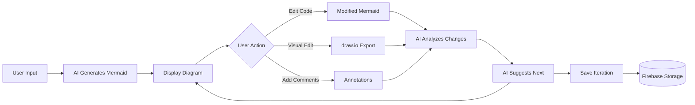

# AI-Human Collaborative Diagram Editor Architecture

## Overview

An interactive system where users and AI iterate on workflow diagrams through multiple refinement cycles.

## Core Loop



## Implementation Phases

### Phase 1: Add Code Editor (Week 1)

**Goal:** Let users edit Mermaid code directly in the app

**Components:**

- Add Monaco Editor or CodeMirror React component
- Split-pane view: Code on left, rendered diagram on right
- Live preview as user types
- Syntax validation

**Files to modify:**

- `web/src/App.js` - Add editor component
- `web/package.json` - Add `@monaco-editor/react` or `react-codemirror2`

**Implementation:**

```javascript
import Editor from "@monaco-editor/react";

const [editMode, setEditMode] = useState(false);
const [editableDiagram, setEditableDiagram] = useState("");

// When user clicks "Edit"
const enableEditMode = () => {
  setEditableDiagram(diagram);
  setEditMode(true);
};

// Live preview
useEffect(() => {
  if (editMode) {
    mermaid.contentLoaded();
  }
}, [editableDiagram]);

// Render
{
  editMode ? (
    <div
      style={{ display: "grid", gridTemplateColumns: "1fr 1fr", gap: "20px" }}
    >
      <Editor
        height="500px"
        language="mermaid"
        value={editableDiagram}
        onChange={(value) => setEditableDiagram(value)}
        theme="vs-dark"
      />
      <div className="mermaid">{editableDiagram}</div>
    </div>
  ) : (
    <div className="mermaid">{diagram}</div>
  );
}
```

### Phase 2: draw.io Integration (Week 2)

**Goal:** Export to draw.io for visual editing, import back

**Option A: URL-based (Simple)**

```javascript
const openInDrawio = () => {
  // draw.io can parse Mermaid via URL
  const base64 = btoa(editableDiagram);
  window.open(
    `https://app.diagrams.net/#R${base64}`,
    "drawio",
    "width=1200,height=800"
  );
};

// User manually copies back or we use postMessage API
window.addEventListener("message", (event) => {
  if (event.data.action === "export") {
    setEditableDiagram(event.data.mermaid);
  }
});
```

**Option B: Embedded iframe (Advanced)**

```javascript
<iframe
  src="https://embed.diagrams.net/?embed=1&proto=json&spin=1"
  style={{ width: "100%", height: "600px" }}
  ref={drawioRef}
/>;

// Send Mermaid to draw.io
drawioRef.current.contentWindow.postMessage(
  JSON.stringify({ action: "load", xml: mermaidToXml(editableDiagram) }),
  "*"
);
```

### Phase 3: Change Analysis (Week 3)

**Goal:** AI understands what user changed and why

**Cloud Function Enhancement:**

```javascript
// functions/index.js
exports.parseWorkflow = functions.https.onRequest(async (req, res) => {
  const { description, mode, originalCode, editedCode, userComment } = req.body;

  let prompt;

  if (mode === "generate") {
    prompt = `Create a Mermaid diagram for: ${description}`;
  } else if (mode === "analyze_changes") {
    prompt = `
Original Mermaid diagram:
\`\`\`mermaid
${originalCode}
\`\`\`

User edited it to:
\`\`\`mermaid
${editedCode}
\`\`\`

User's comment: "${userComment}"

Analyze the changes:
1. What did the user add/remove/modify?
2. What was their likely intent?
3. Are there any issues or improvements you'd suggest?
4. Should we add any missing error handling, edge cases, or branches?

Return a JSON response with:
{
  "changes": ["list of specific changes"],
  "intent": "likely reason for changes",
  "suggestions": ["improvement suggestions"],
  "nextIteration": "refined mermaid code incorporating feedback"
}
`;
  }

  const response = await openai.chat.completions.create({
    model: "gpt-4o",
    messages: [{ role: "user", content: prompt }],
  });

  const result =
    mode === "analyze_changes"
      ? JSON.parse(response.choices[0].message.content)
      : { mermaid: response.choices[0].message.content };

  res.json(result);
});
```

**Frontend Integration:**

```javascript
const submitChanges = async () => {
  const analysis = await fetch(cloudFunctionURL, {
    method: "POST",
    headers: { "Content-Type": "application/json" },
    body: JSON.stringify({
      mode: "analyze_changes",
      originalCode: diagram,
      editedCode: editableDiagram,
      userComment: userComments,
    }),
  }).then((r) => r.json());

  // Add to conversation history
  const newIteration = {
    step: conversationHistory.length + 1,
    timestamp: Date.now(),
    userPrompt: text,
    aiGenerated: diagram,
    userEdits: {
      code: editableDiagram,
      comment: userComments,
    },
    aiAnalysis: analysis.intent,
    aiSuggestions: analysis.suggestions,
    nextProposal: analysis.nextIteration,
  };

  setConversationHistory([...conversationHistory, newIteration]);

  // Show AI's analysis and suggestions
  setAiFeedback(analysis);
};
```

### Phase 4: Conversation Persistence (Week 4)

**Goal:** Save entire iteration history for later review

**Data Structure:**

```javascript
const saveConversation = async (title) => {
  const conversationData = {
    diagramId: generateId(),
    title: title || "Untitled Workflow",
    createdAt: Date.now(),
    lastModified: Date.now(),
    iterations: conversationHistory,
    currentVersion: editableDiagram,
    metadata: {
      tags: extractTags(text),
      complexity: conversationHistory.length,
    },
  };

  // Save to Firebase Storage
  const conversationRef = ref(
    storage,
    `conversations/${conversationData.diagramId}.json`
  );

  await uploadString(
    conversationRef,
    JSON.stringify(conversationData, null, 2)
  );

  alert("Conversation saved!");
};

const loadConversation = async (diagramId) => {
  const conversationRef = ref(storage, `conversations/${diagramId}.json`);
  const data = await getBytes(conversationRef);
  const conversation = JSON.parse(new TextDecoder().decode(data));

  setConversationHistory(conversation.iterations);
  setEditableDiagram(conversation.currentVersion);

  // Optionally jump to specific iteration
  setCurrentIteration(conversation.iterations.length - 1);
};
```

## UI Enhancements

### Iteration Timeline View

```javascript
<div className="timeline">
  {conversationHistory.map((iteration, index) => (
    <div key={index} className="iteration-card">
      <h4>Step {iteration.step}</h4>
      <p>
        <strong>You:</strong> {iteration.userPrompt}
      </p>
      {iteration.userEdits && (
        <p>
          <strong>Your edits:</strong> {iteration.userEdits.comment}
        </p>
      )}
      <p>
        <strong>AI Analysis:</strong> {iteration.aiAnalysis}
      </p>
      {iteration.aiSuggestions.length > 0 && (
        <details>
          <summary>AI Suggestions</summary>
          <ul>
            {iteration.aiSuggestions.map((s, i) => (
              <li key={i}>{s}</li>
            ))}
          </ul>
        </details>
      )}
      <button onClick={() => jumpToIteration(index)}>
        Restore this version
      </button>
    </div>
  ))}
</div>
```

### Comment/Annotation System

```javascript
const [annotations, setAnnotations] = useState([]);

// Add comment to specific node
const addAnnotation = (nodeId, comment) => {
  setAnnotations([
    ...annotations,
    {
      nodeId,
      comment,
      timestamp: Date.now(),
      author: "user",
    },
  ]);
};

// Display annotations next to diagram
<div className="annotations-panel">
  {annotations.map((ann, i) => (
    <div key={i} className="annotation">
      <span className="node-badge">{ann.nodeId}</span>
      <p>{ann.comment}</p>
    </div>
  ))}
</div>;
```

## Advanced Features

### 1. Diff Visualization

Show what changed between iterations:

```javascript
import { diffLines } from "diff";

const showDiff = (oldCode, newCode) => {
  const diff = diffLines(oldCode, newCode);
  return diff.map((part, i) => (
    <span
      key={i}
      style={{
        backgroundColor: part.added
          ? "#d4edda"
          : part.removed
          ? "#f8d7da"
          : "transparent",
        textDecoration: part.removed ? "line-through" : "none",
      }}
    >
      {part.value}
    </span>
  ));
};
```

### 2. Voice Input

Record voice description instead of typing:

```javascript
const startVoiceInput = () => {
  const recognition = new window.webkitSpeechRecognition();
  recognition.onresult = (event) => {
    const transcript = event.results[0][0].transcript;
    setText(transcript);
    generateWorkflow(); // Auto-trigger
  };
  recognition.start();
};
```

### 3. Collaborative Mode (Future)

Multiple users editing same diagram:

- Use Firebase Realtime Database for live sync
- Show cursors of other users
- Conflict resolution

## File Structure

```
webaii/
├── functions/
│   └── index.js (enhanced with analyze_changes mode)
├── web/
│   └── src/
│       ├── App.js (main component)
│       ├── components/
│       │   ├── MermaidEditor.js
│       │   ├── DrawioIntegration.js
│       │   ├── IterationTimeline.js
│       │   ├── AnnotationPanel.js
│       │   └── DiffViewer.js
│       └── utils/
│           ├── conversationManager.js
│           └── mermaidParser.js
└── ARCHITECTURE.md (this file)
```

## Cost Considerations

**Firebase Storage:**

- Each conversation ~10-50 KB
- 1000 conversations ≈ 10-50 MB
- Free tier: 5 GB → supports ~100K conversations

**OpenAI API:**

- Initial generation: ~500 tokens ($0.001)
- Change analysis: ~1000 tokens ($0.002)
- 1000 iterations: ~$3

## Next Steps

1. **Week 1:** Implement basic code editor
2. **Week 2:** Add draw.io integration
3. **Week 3:** Enhance Cloud Function for change analysis
4. **Week 4:** Implement conversation persistence
5. **Week 5:** Add timeline UI and iteration navigation
6. **Week 6:** Testing and refinement
